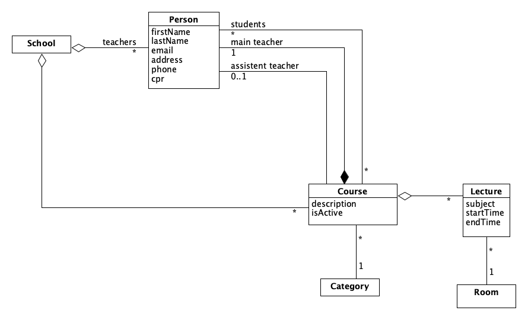
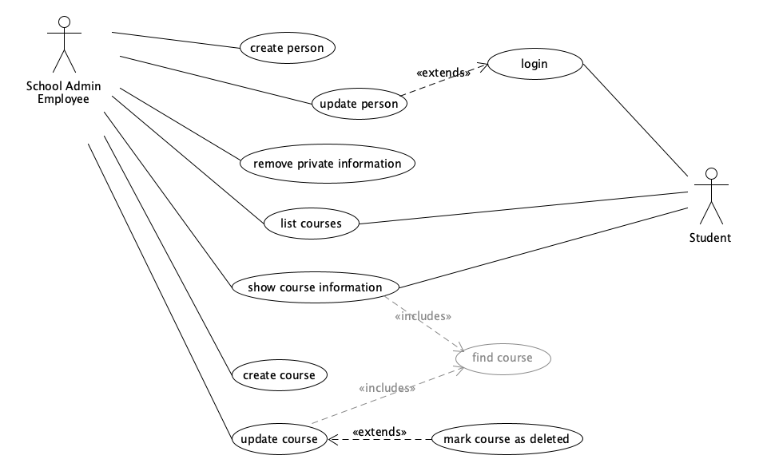

# Devolpment of Large Systems

Example contract repository

## Glossary

### Nouns
| Word         | LDM   | Description                           |
| :----------- | :---: | :------------------------------------ |
| IT System    |       |     |
| Student      |   x   |     |
| Web Service  |       |     |
| Night School |   ?   |     |
| Web Application |    |     |
| Employee (in school administration) | x |  |
| Teacher      |   x   |     |
| Course       |   x   |     |
| Main Responsible Teacher | x | |
| First Name   |   x   |     |
| Last Name    |   x   |     |
| Email        |   x   |     |
| Address      |   x   |     |
| Phone Number |   x   |     |
| Social Security Number | x | |
| Person       |   x   |     |
| Lecture      |   x   |     |
| Subject      |   x   |     |
| Category     |   x   |     |
| Description  |   x   |     |
| Start Time   |   x   |     |
| End Time     |   x   |     |
| Room         |   x   |     |
| Information (about students) |   x   |     |
| Text File    |       |     |
| List of Courses|  x  |     |

### Verbs
| Word                            | UCM   | Description                           |
| :------------------------------ | :---: | :------------------------------------ |
| Registering Students            |       | |
| Integrate with Schools          |   ?   | |
| _login in_                      |  (x)  | |
| _make changes_                  |  (x)  | |
| associate students and teachers |   x   | |
| create course                   |   x   | |
| update course                   |   x   | |
| mark course as deleted          |   x   | |
| create student                  |   x   | |
| create teacher                  |   x   | |
| update student                  |   x   | |
| update teacher                  |   x   | |
| remove private information on student |  x   | |
| remove private information on teacher |  x   | |
| list course with category             |  x   | |
| give detailed information             |  x   | |

## Logical Data Model

## Use Case Model

### Use case descriptions

#### UC1

**Name**: find course

**Description**: Find a spefic course for later updating or details

**Primary Actor**: School Admin Employee

**Preconditions**: none

**Main Scenario**:
  1. User selects find course.
  2. System shows searchform.
  3. User enters search data, and submits form.
  4. System list relevant courses
  5. User selects a course in List

**Postcondition** (Success guaranties) A specific couse is selected

**Alternative scenarios**
**Alternative postconditions**

#### UC2
...

**Main Scenario**
  1. User selects course (UC1)
  2. ...
